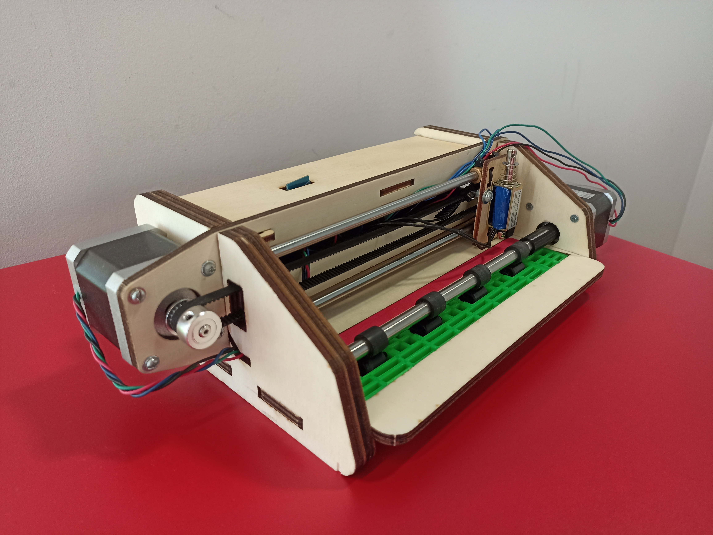
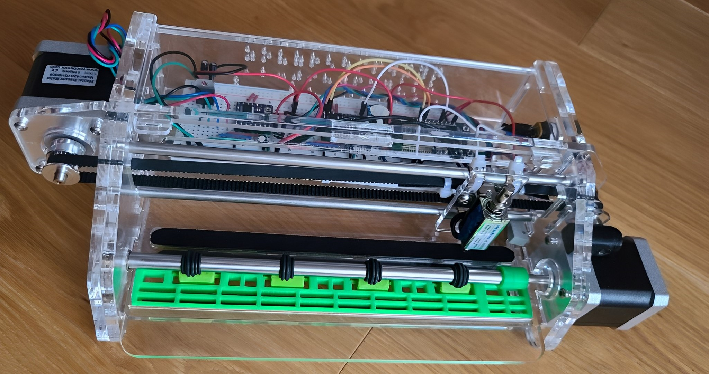

# BraillePrinter - Beta (work in progress)
- This project is based on the project of iapafoto: https://github.com/iapafoto/BraillePrinter
- Instructionsvideos: https://www.instructables.com/id/Cheap-Braille-Embosser-La-Picoreuse/
- OpenScad: Laser cut design https://www.thingiverse.com/thing:2841496

## Variante Arduino Uno (poplar wood)

## Variante ESP32 (acrylic)

